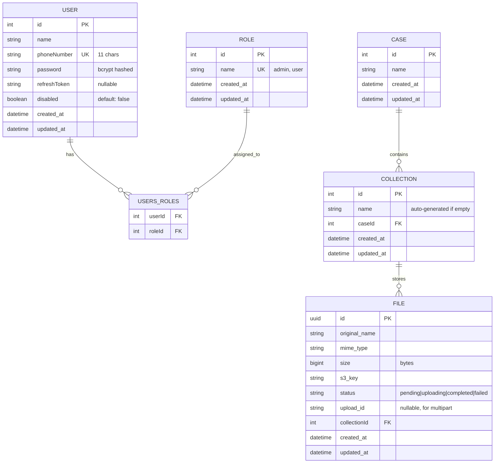

# File Manager Backend

A production-ready file management system built with NestJS, featuring resumable uploads/downloads, role-based access control, and Redis-backed OTP authentication.

---

## 📋 Project Overview

### What This App Does

The File Manager Backend is a RESTful API service that provides secure file storage and management capabilities. It enables users to:

- **Upload large files** using resumable multipart uploads (via AWS S3/MinIO)
- **Organize files** into collections within cases
- **Download files** with presigned URLs for secure, temporary access
- **Manage users** with role-based permissions (Admin/User)
- **Authenticate securely** using phone-based OTP verification with Redis

### How It Works

The application follows a **three-tier architecture**:

1. **Controllers** - Handle HTTP requests/responses and route validation
2. **Services** - Implement business logic and orchestration
3. **Repositories** - Manage database operations via TypeORM

**Key Features:**
- **Multipart Uploads**: Files are split into chunks (~5MB each) and uploaded concurrently for better performance and resumability
- **Presigned URLs**: Direct S3/MinIO access URLs with expiration for secure downloads
- **Redis-Based Auth**: OTP codes are stored in Redis with TTL, preventing database spam during registration
- **Token Rotation**: JWT access tokens (15m) + refresh tokens (7d) stored in HTTP-only cookies
- **Data Integrity**: Foreign key constraints and cascade deletions ensure referential integrity

---

## 🚀 Setup Instructions

### Prerequisites

- Docker & Docker Compose installed
- Git

### Running with Docker Compose

1. **Clone the repository**
   ```bash
   git clone https://github.com/zand98/file-manager-backend.git
   cd file-manager-backend
   ```

2. **Create environment file**
   ```bash
   cp .env.example .env
   ```

3. **Configure environment variables** (`.env`)
   ```env
   # Application
   APP_ENV=dev
   PORT=3000
   APP_NAME=filemanager

   # Database (MySQL)
   DB_TYPE=mysql
   DB_USERNAME=file_manager
   DB_PASSWORD=file_manager
   DB_HOST=db
   DB_PORT=3306
   DB_DATABASE=file_manager

   # MinIO (S3-compatible storage)
   MINIO_ENDPOINT=minio
   MINIO_PORT=9000
   MINIO_ACCESS_KEY=minioadmin
   MINIO_SECRET_KEY=minioadmin
   MINIO_BUCKET_NAME=file-manager

   # Redis
   REDIS_HOST=redis
   REDIS_PORT=6379

   # Authentication Tokens
   ACCESS_TOKEN_SECRET_KEY=your-secret-key-here
   ACCESS_TOKEN_EXPIRATION_TIME=15m
   REFRESH_TOKEN_SECRET_KEY=your-refresh-secret-here
   REFRESH_TOKEN_EXPIRATION_TIME=7d

   # OTP (set to true for development to skip SMS)
   OTP_DISABLE=true
   ```

4. **Start all services**
   ```bash
   docker compose up -d
   ```

   This will start:
   - **MySQL** database on port `3306`
   - **MinIO** object storage on ports `9000` (API) and `9001` (Console)
   - **Redis** on port `6379`
   - **Redis Commander** (GUI) on port `8081`

5. **Run the application locally** (outside Docker)
   ```bash
   npm install
   npm run start:dev
   ```

   The API will be available at: `http://localhost:3000`

6. **Seed the database with initial data**
   
   Before using the system, you must create an admin user. Without a configured user, you won't have permission to access the system.
   
   ```bash
   npm run seed
   ```
   
   This will create:
   - **Roles**: `admin` and `user`
   - **Admin User**:
     - Phone: `07700000000`
     - Password: `Secure_Pass123`
     - Role: `admin`
   
   **How to login with the admin account:**
   
   Use the `/api/auth/login` endpoint with the credentials above:
   
   ```json
   {
     "phoneNumber": "07700000000",
     "password": "Secure_Pass123"
   }
   ```
   
   After successful login, authentication tokens will be stored in HTTP-only cookies automatically.

7. **Access services**
   - **API Documentation (Swagger)**: http://localhost:3000/api
   - **MinIO Console**: http://localhost:9001 (credentials: `minioadmin` / `minioadmin`)
   - **Redis Commander**: http://localhost:8081
---

## 🧪 Testing Instructions

The project maintains **100% test coverage** with **52 unit tests** covering all modules.

### Run Tests Locally

```bash
# Run all tests
npm test

# Run specific test file
npm test src/modules/cases/cases.service.spec.ts

# Watch mode (re-run on file changes)
npm run test:watch
```

### Run Tests with Docker

```bash
# Build the test container
docker compose build test

# Run tests in container
docker compose run --rm test
```

### Test Coverage Summary

- ✅ **11 test suites** (all passing)
- ✅ **72 unit tests** (all passing)
- ✅ **Modules covered**: Auth, Cases, Collections, Files, MinIO, Roles, Users

**Key Test Scenarios:**
- Resumable upload initialization and completion
- Default collection creation when none provided
- Rollback logic on S3 upload failures
- OTP verification flow
- Token refresh and rotation
- File deletion with cascade operations
---

## 📚 API Documentation

### Interactive Documentation

**Swagger UI**: http://localhost:3000/api

The API uses **OpenAPI 3.0** specification with full Swagger documentation, including:
- Request/response schemas
- Authentication requirements
- Example payloads
- Error codes

### Authentication

The API uses **JWT tokens** stored in **HTTP-only cookies**:

1. **Access Token** (15 minutes)
   - Used for API requests
   - Stored in HTTP-only cookie

2. **Refresh Token** (7 days)
   - Used to obtain new access tokens
   - Stored in HTTP-only cookie with restricted path (`/api/auth/refresh-token`)

**Authentication Flow:**
```
1. Register → OTP sent to phone
2. Send OTP → OTP stored in Redis with expiration time
3. Verify OTP → Returns access + refresh tokens in HTTP-only cookies
4. Use access token for API calls (automatically sent via cookies)
5. When expired → Use refresh token to get new access token
```

### Sample Requests/Responses

#### 1. Register User

**Request:**
```http
POST /api/auth/register
Content-Type: application/json

{
  "name": "John Doe",
  "phoneNumber": "07012345678",
  "password": "SecurePass123!",
  "roles": [
    "user"
  ]
}
```

**Note**: 
- The `roles` field is **required** and must be an array of role names.
- By default, roles `"user"` and `"admin"` exist in the system (created by the seeder).
- You can create additional roles using the `POST /api/roles` endpoint.

**Response:**
```json
{
  "statusCode": "OTP_SENT",
  "message": "OTP sent successfully. Please verify to complete registration."
}
```

#### 2. Verify OTP

**Request:**
```http
POST /api/auth/verify-otp
Content-Type: application/json

{
  "phoneNumber": "07012345678",
  "otpCode": "123456"
}
```

**Response:**
```json
{
  "user": {
    "id": 1,
    "name": "John Doe",
    "phoneNumber": "07012345678",
    "roles": ["user"]
  },
  "message": "Registration completed successfully"
}
```
*Note: Access and refresh tokens are automatically set as HTTP-only cookies*

#### 3. Login

**Request:**
```http
POST /api/auth/login
Content-Type: application/json

{
  "phoneNumber": "07012345678",
  "password": "SecurePass123!"
}
```

**Response:**
```json
{
  "user": {
    "id": 1,
    "name": "John Doe",
    "phoneNumber": "07012345678"
  }
}
```

#### 4. Create Case

**Request:**
```http
POST /cases
Content-Type: application/json

{
  "name": "Evidence Case #2024-001"
}
```
*Note: Authentication is handled automatically via HTTP-only cookies*

**Response:**
```json
{
  "id": 1,
  "name": "Evidence Case #2024-001",
  "created_at": "2026-02-15T18:30:00Z",
  "updated_at": "2026-02-15T18:30:00Z"
}
```

#### 5. Initialize File Upload

**Request:**
```http
POST /cases/1/uploads/init
Content-Type: application/json

{
  "collectionId": 5,
  "files": [
    {
      "fileName": "evidence_video.mp4",
      "mimeType": "video/mp4",
      "fileSize": 524288000
    }
  ]
}
```

**Response:**
```json
{
  "collectionId": 5,
  "uploads": [
    {
      "fileId": "a3b2c1d4-e5f6-7890-abcd-ef1234567890",
      "uploadId": "MultipartUploadId",
      "fileName": "evidence_video.mp4",
      "totalParts": 100
    }
  ]
}
```

#### 6. Get Upload Part URL

**Request:**
```http
GET /files/a3b2c1d4-e5f6-7890-abcd-ef1234567890/part-url?partNumber=1
```

**Response:**
```json
{
  "url": "https://minio:9000/file-manager/a3b2c1d4.../part1?uploadId=...&signature=...",
  "expiresIn": 3600
}
```

#### 7. Complete Upload

**Request:**
```http
POST /files/a3b2c1d4-e5f6-7890-abcd-ef1234567890/complete
Content-Type: application/json

{
  "parts": [
    { "PartNumber": 1, "ETag": "\"etag-from-s3-response\"" },
    { "PartNumber": 2, "ETag": "\"etag-2\"" }
  ]
}
```

**Response:**
```json
{
  "id": "a3b2c1d4-e5f6-7890-abcd-ef1234567890",
  "original_name": "evidence_video.mp4",
  "status": "completed",
  "size": 524288000
}
```

#### 8. Get Download URL

**Request:**
```http
GET /files/a3b2c1d4-e5f6-7890-abcd-ef1234567890/download
```

**Response:**
```json
{
  "url": "https://minio:9000/file-manager/a3b2c1d4...?signature=...",
  "expiresIn": 3600,
  "fileName": "evidence_video.mp4"
}
```

### Error Responses

All errors follow a consistent format:

```json
{
  "statusCode": 400,
  "message": "Validation failed",
  "error": "Bad Request"
}
```

**Common Status Codes:**
- `400` - Bad Request (invalid input)
- `401` - Unauthorized (missing/invalid token)
- `403` - Forbidden (insufficient permissions)
- `404` - Not Found
- `429` - Too Many Requests (rate limit exceeded)
- `500` - Internal Server Error

### Role-Based Endpoints

| Role    | Permissions |
|---------|-------------|
| `admin` | Full access: create, read, update, delete, upload, download |
| `user`  | Read-only: list files, view file details |

---

## 🗄️ Database Schema

### Entity Relationship Diagram (Mermaid)



### Schema Details

#### **Users Table** (`user`)
| Column         | Type         | Constraints | Description |
|----------------|--------------|-------------|-------------|
| `id`           | INT          | PK, AUTO_INCREMENT | Unique user identifier |
| `name`         | VARCHAR      | NOT NULL    | User's full name |
| `phoneNumber`  | VARCHAR(11)  | UNIQUE, NOT NULL | Phone number (11 digits) |
| `password`     | VARCHAR      | NOT NULL    | Bcrypt-hashed password |
| `refreshToken` | VARCHAR      | NULLABLE    | Current refresh token |
| `disabled`     | BOOLEAN      | DEFAULT FALSE | Account status |
| `created_at`   | TIMESTAMP    | NOT NULL    | Creation timestamp |
| `updated_at`   | TIMESTAMP    | NOT NULL    | Last update timestamp |

**Indexes:**
- Primary Key on `id`
- Unique index on `phoneNumber`

---

#### **Roles Table** (`role`)
| Column       | Type      | Constraints | Description |
|--------------|-----------|-------------|-------------|
| `id`         | INT       | PK, AUTO_INCREMENT | Role ID |
| `name`       | VARCHAR   | UNIQUE, NOT NULL | Role name (e.g., 'admin', 'user') |
| `created_at` | TIMESTAMP | NOT NULL    | Creation timestamp |
| `updated_at` | TIMESTAMP | NOT NULL    | Last update timestamp |

**Indexes:**
- Primary Key on `id`
- Unique index on `name`

---

#### **User-Roles Junction Table** (`users_roles`)
| Column   | Type | Constraints | Description |
|----------|------|-------------|-------------|
| `userId` | INT  | FK → user.id | References user |
| `roleId` | INT  | FK → role.id | References role |

**Constraints:**
- Foreign Key: `userId` → `user(id)` ON DELETE CASCADE
- Foreign Key: `roleId` → `role(id)` ON DELETE CASCADE
- Composite Primary Key: (`userId`, `roleId`)

---

#### **Cases Table** (`cases`)
| Column       | Type      | Constraints | Description |
|--------------|-----------|-------------|-------------|
| `id`         | INT       | PK, AUTO_INCREMENT | Case ID |
| `name`       | VARCHAR   | NOT NULL    | Case name/title |
| `created_at` | TIMESTAMP | NOT NULL    | Creation timestamp |
| `updated_at` | TIMESTAMP | NOT NULL    | Last update timestamp |

**Indexes:**
- Primary Key on `id`

---

#### **Collections Table** (`collections`)
| Column       | Type      | Constraints | Description |
|--------------|-----------|-------------|-------------|
| `id`         | INT       | PK, AUTO_INCREMENT | Collection ID |
| `name`       | VARCHAR   | NOT NULL    | Collection name (auto-generated if not provided) |
| `caseId`     | INT       | FK → cases.id, NOT NULL | Parent case |
| `created_at` | TIMESTAMP | NOT NULL    | Creation timestamp |
| `updated_at` | TIMESTAMP | NOT NULL    | Last update timestamp |

**Constraints:**
- Foreign Key: `caseId` → `cases(id)` ON DELETE CASCADE

**Indexes:**
- Primary Key on `id`
- Foreign Key index on `caseId`

---

#### **Files Table** (`files`)
| Column         | Type         | Constraints | Description |
|----------------|--------------|-------------|-------------|
| `id`           | UUID         | PK          | Unique file identifier (GUID) |
| `original_name`| VARCHAR      | NOT NULL    | Original filename |
| `mime_type`    | VARCHAR      | NOT NULL    | File MIME type |
| `size`         | BIGINT       | NOT NULL    | File size in bytes |
| `s3_key`       | VARCHAR      | NOT NULL    | S3/MinIO object key |
| `status`       | VARCHAR(20)  | NOT NULL, DEFAULT 'pending' | Upload status (pending, uploading, completed, failed) |
| `upload_id`    | VARCHAR      | NULLABLE    | S3 multipart upload ID |
| `collectionId` | INT          | FK → collections.id, NOT NULL | Parent collection |
| `created_at`   | TIMESTAMP    | NOT NULL    | Creation timestamp |
| `updated_at`   | TIMESTAMP    | NOT NULL    | Last update timestamp |

**Constraints:**
- Foreign Key: `collectionId` → `collections(id)` ON DELETE CASCADE

**Indexes:**
- Primary Key on `id` (UUID)
- Foreign Key index on `collectionId`

---

### Data Relationships

1. **User ↔ Role** (Many-to-Many)
   - A user can have multiple roles
   - A role can be assigned to multiple users
   - Junction table: `users_roles`

2. **Case → Collection** (One-to-Many)
   - A case can contain multiple collections
   - A collection belongs to one case
   - Cascade delete: Deleting a case removes all its collections

3. **Collection → File** (One-to-Many)
   - A collection can store multiple files
   - A file belongs to one collection
   - Cascade delete: Deleting a collection removes all its files from both DB and S3

---

## 🏗️ Assumptions & Design Decisions

### Architecture Decisions

#### 1. **Multipart Upload Strategy**
**Decision**: Use S3-compatible multipart uploads instead of direct file uploads.

**Rationale**:
- **Resumability**: Clients can retry individual parts instead of re-uploading entire files
- **Performance**: Concurrent part uploads significantly improve speed for large files
- **Reliability**: Network interruptions don't require starting over
- **Scalability**: Server doesn't need to buffer entire files in memory

**Trade-offs**:
- More complex client implementation
- Requires additional API calls (init → part URLs → complete)
- Storage overhead for incomplete uploads (mitigated by S3 lifecycle policies)

---

#### 2. **Redis for OTP Storage**
**Decision**: Store pending registrations and OTP codes in Redis instead of the database.

**Rationale**:
- **Performance**: In-memory storage is ~100x faster than disk-based databases
- **Auto-expiration**: TTL automatically cleans up expired OTPs (no cron jobs needed)
- **Prevents spam**: Failed/abandoned registrations don't pollute the database
- **Separation of concerns**: Transient data stays separate from permanent data

**Trade-offs**:
- Adds dependency on Redis
- OTP codes are lost if Redis crashes (acceptable for temporary data)

---

#### 3. **UUID for File IDs**
**Decision**: Use UUIDs instead of auto-increment integers for file identifiers.

**Rationale**:
- **Non-sequential**: Harder to enumerate/guess file IDs
- **Distributed generation**: Can generate IDs client-side without database round-trip
- **Merge-friendly**: No ID conflicts when merging databases
- **S3 key compatibility**: UUIDs work well in S3 object keys

**Trade-offs**:
- Larger storage footprint (36 bytes vs 4-8 bytes)
- Slightly slower index lookups (mitigated by modern databases)

---

#### 4. **JWT Tokens in HTTP-Only Cookies**
**Decision**: Store tokens in HTTP-only cookies instead of localStorage.

**Rationale**:
- **XSS protection**: JavaScript cannot access HTTP-only cookies
- **Automatic transmission**: Browser sends cookies with every request
- **Path restriction**: Refresh token only sent to `/api/auth/refresh-token`

**Trade-offs**:
- CSRF attacks possible (mitigated by SameSite=Lax)
- More complex mobile/native app integration
- Requires CORS configuration

---

#### 5. **Role-Based Access Control (RBAC)**
**Decision**: Implement custom JWT-based RBAC instead of using external auth providers.

**Rationale**:
- **Full control**: Complete ownership of auth flow
- **Offline-first**: No dependency on third-party services
- **Customization**: Easy to add new roles/permissions
- **Cost**: No per-user pricing

**Trade-offs**:
- Must maintain security ourselves (password hashing, token rotation, etc.)
- Missing features like SSO, OAuth providers (could be added later)

---

#### 6. **Docker Compose for Local Development**
**Decision**: Use Docker Compose for dependencies but run app locally.

**Rationale**:
- **Fast iteration**: `npm run start:dev` with hot reload is faster than Docker rebuilds
- **Easy debugging**: Direct access to Node.js debugger
- **Consistent environment**: Database/Redis/MinIO always match production setup

**Trade-offs**:
- Developers need Node.js installed locally
- Initial setup is slightly more complex

---

#### 7. **Presigned URLs for Downloads**
**Decision**: Generate time-limited presigned URLs instead of proxying file data through the API.

**Rationale**:
- **Performance**: Direct S3 → client transfer bypasses application server
- **Bandwidth savings**: Reduces server egress costs
- **Scalability**: Server doesn't become bottleneck for large files
- **CDN-friendly**: Presigned URLs can be cached/CDN-accelerated

**Trade-offs**:
- Clients see raw S3/MinIO URLs (not always desirable)
- Time-limited access (URLs expire after 1 hour)

---

#### 8. **Default Collection Creation**
**Decision**: Automatically create a collection with timestamp name if none provided during upload.

**Rationale**:
- **User experience**: Users can upload files without pre-creating collections
- **Batch uploads**: Multiple files go into one collection (not separate collections)
- **Data integrity**: Every file must belong to a collection (enforced by foreign key)

**Trade-offs**:
- Clients should ideally provide collection names

---

### Limitations & Known Issues

#### 1. **No File Versioning**
**Current State**: Files cannot be updated; only deleted/re-uploaded.

**Future Enhancement**: Implement version history (similar to S3 object versioning).

---

#### 2. **Single Bucket**
**Current State**: All files stored in one MinIO bucket.

**Future Enhancement**: Separate buckets per case for better isolation.

---

#### 3. **OTP via Redis**
**Current State**: Obtain OTP codes through Redis (not sent via SMS/email).

**Future Enhancement**: Integrate with Twilio/AWS SNS for real SMS delivery.

---

#### 4. **No File Scanning**
**Current State**: No virus/malware scanning on uploaded files.

**Future Enhancement**: Integrate ClamAV or AWS S3 Object Lambda for scanning.

---

#### 5. **Rate Limiting**
**Current State**: Basic rate limiting (100 req/min) applied globally.

**Future Enhancement**: Per-user rate limits, different limits for upload/download endpoints.

---

#### 6. **No Audit Logs**
**Current State**: No tracking of who uploaded/deleted/downloaded files.

**Future Enhancement**: Audit log table with user actions and timestamps.

---

## 🛠️ Tech Stack & Tools Used

### Backend Framework
- **NestJS** `v10.4` - Progressive Node.js framework with TypeScript support
  - Modular architecture (Controllers → Services → Repositories)
  - Dependency injection
  - Built-in decorators for validators, guards, interceptors

### Database
- **MySQL** `v8.0` - Relational database
  - ACID compliance for data integrity
  - TypeORM for migrations and query building
- **TypeORM** `v0.3.25` - ORM for TypeScript/JavaScript
  - Entity-based models
  - Migration system
  - Repository pattern

### Object Storage
- **MinIO** - S3-compatible object storage
  - Multipart upload support
  - Presigned URL generation
  - Bucket lifecycle policies
- **AWS SDK for S3** `v3.987` - S3 client library
  - `@aws-sdk/client-s3` - Core S3 operations
  - `@aws-sdk/s3-request-presigner` - Presigned URL generation

### Caching & Session Management
- **Redis** `v7` (Alpine) - In-memory data store
  - OTP code storage with TTL
  - Session management (future)
  - Rate limiting (future)
- **IORedis** `v5.9` - Redis client for Node.js

### Authentication & Security
- **Passport** `v0.7` - Authentication middleware
  - JWT strategy (`passport-jwt`)
  - Custom guards for role-based access
- **JWT** (`@nestjs/jwt`) - Token generation/validation
- **Bcrypt** `v6.0` - Password hashing
- **Helmet** `v8.1` - HTTP security headers
- **express-rate-limit** `v8.0` - Rate limiting middleware
- **cookie-parser** `v1.4` - Cookie parsing for token storage

### Validation & Serialization
- **class-validator** `v0.14.2` - Decorator-based validation
- **class-transformer** `v0.5.1` - Object transformation
- **Joi** `v17.13` - Environment variable validation

### API Documentation
- **Swagger UI** (`@nestjs/swagger`, `swagger-ui-express`)
  - Interactive API explorer
  - OpenAPI 3.0 specification
  - Automatic schema generation from TypeScript classes

### Testing
- **Jest** `v30.0` - Testing framework
  - Unit tests: 52 tests across 7 suites
  - Mocking: `@nestjs/testing` module
  - Coverage reporting: `jest --coverage`
- **ts-jest** `v29.4` - TypeScript support for Jest

### Development Tools
- **TypeScript** `v5.8` - Type-safe JavaScript
- **ESLint** `v9.31` - Linting with TypeScript support
- **Prettier** `v3.6` - Code formatting
- **Nodemon** (via `nest start --watch`) - Hot reload in development
- **npm-check-updates** - Dependency version management

### DevOps & Containerization
- **Docker** - Containerization
  - `Dockerfile` for production builds
  - `Dockerfile.test` for test execution
- **Docker Compose** - Multi-container orchestration
  - MySQL, MinIO, Redis, Redis Commander
- **Redis Commander** - Redis GUI for debugging

### Additional Libraries
- **Axios** `v1.13` - HTTP client (for external API calls)
- **dotenv** `v17.3` - Environment variable loading
- **rimraf** `v5.0` - Cross-platform file deletion (for build cleanup)

---

## 📁 Project Structure

```
file-manager-backend/
├── src/
│   ├── main.ts                      # Application entry point
│   ├── modules/
│   │   ├── auth/                    # Authentication & authorization
│   │   ├── cases/                   # Case management
│   │   ├── collections/             # Collection management
│   │   ├── files/                   # File upload/download/delete
│   │   ├── minio/                   # S3/MinIO service
│   │   ├── redis/                   # Redis service
│   │   ├── roles/                   # Role management
│   │   ├── user/                    # User management
│   │   └── config/                  # Configuration module
│   └── shared/
│       ├── entities/                # Base entities (timestamps)
│       ├── interceptors/            # Global interceptors
│       └── constants/               # Shared constants
├── docker-compose.yml               # Service orchestration
├── Dockerfile                       # Production image
├── Dockerfile.test                  # Test execution image
├── .env.example                     # Environment template
├── package.json                     # Dependencies
├── tsconfig.json                    # TypeScript config
├── jest.config.json                 # Test config
├── README.md                        # This file
├── TESTING.md                       # Detailed test documentation
└── AUTH_REDIS_GUIDE.md              # Authentication system guide
```

---

## 🔗 Additional Resources

- **Authentication Guide**: [`AUTH_REDIS_GUIDE.md`](./AUTH_REDIS_GUIDE.md)
- **Testing Documentation**: [`TESTING.md`](./TESTING.md)
- **Swagger API Docs**: http://localhost:3000/api (when running)
- **MinIO Console**: http://localhost:9001
- **Redis Commander**: http://localhost:8081

---

## 📞 Author

**Zand Yassin**  
Email: zandyasin98@gmail.com

---

## 📄 License

UNLICENSED - Private project
